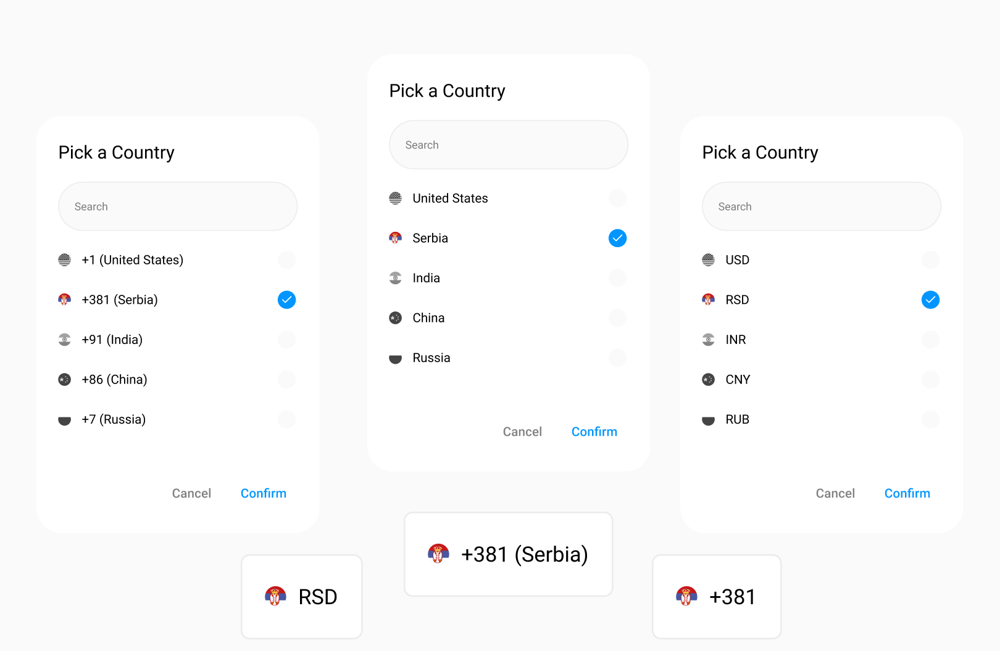

<p align="center">
  <H1>🌎 Country Picker KMP Library</H1>
</p>

<p align="center">
  
</p>

You've just started a new project and need to implement a feature that allows users to select a `country`, `phone number`, `dial code`, or `currency` and you're realizing it involves a lot of boilerplate: managing country data, handling `flags`, and building a clean UI. This library is built to solve exactly that. It provides a powerful yet simple `Country` enum class that includes all these information for you. But it doesn’t stop there. To make integration even better, the library includes two prebuilt UI components:

  `CountryPickerDialog`: A searchable dialog that allows users to browse and select from a list of countries.

  `CountryPickerField`: A UI component similar to a TextField that displays the currently selected country and opens the picker dialog on click.

This is a lightweight and fully customizable Kotlin Multiplatform (KMP) solution designed to work seamlessly across Android, iOS, Desktop, and Kotlin/WASM targets.


## ✨ Features

- ✅ Predefined list of countries with:
  - Name
  - Dial code
  - Currency
  - Flag resource
- ✅ Built-in `CountryPickerDialog` and `CountryPickerField` Composables
- ✅ Real-time search support
- ✅ Multiple display options: Dial Code, Currency, Name
- ✅ Kotlin Multiplatform ready (Android, iOS, Desktop, WASM)


### Gradle

Make sure to include the library in your `commonMain` source set:

```kotlin
implementation("com.stevdza-san:countrypicker:1.0.0")
```

## Usage
### Show Country Picker Dialog

```kotlin
var selectedCountry by remember { mutableStateOf(Country.Serbia) }
var showDialog by remember { mutableStateOf(false) }

AnimatedVisibility(visible = showDialog) {
    CountryPickerDialog(
        selectedCountry = selectedCountry,
        onConfirmClick = { country ->
            selectedCountry = country
            showDialog = false
        },
        onDismiss = { showDialog = false }
    )
}

CountryPickerField(
    selectedCountry = selectedCountry,
     onClick = { showDialog = true }
)
```

## Display Options

### Choose how to display the country label:

```kotlin
enum class CountryDisplayOption {
    NAME,
    CURRENCY,
    DIAL_CODE,
    DIAL_CODE_AND_NAME,
    NAME_AND_CURRENCY
}
```

### Data Model

```kotlin
enum class Country(
    val dialCode: Int,
    val currency: String,
    val flag: DrawableResource
)
```

### To get all available countries:

```kotlin
val allCountries = Country.entries
```
